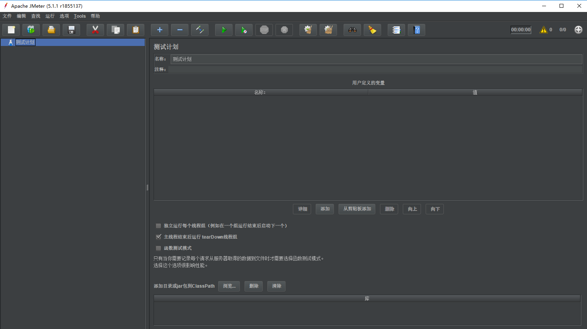
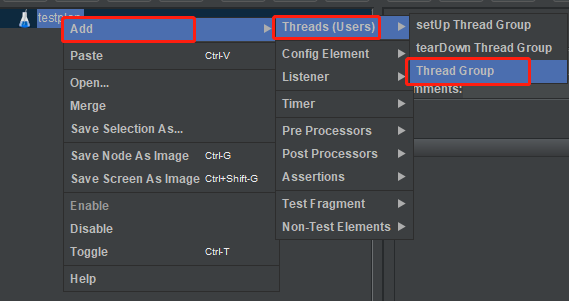
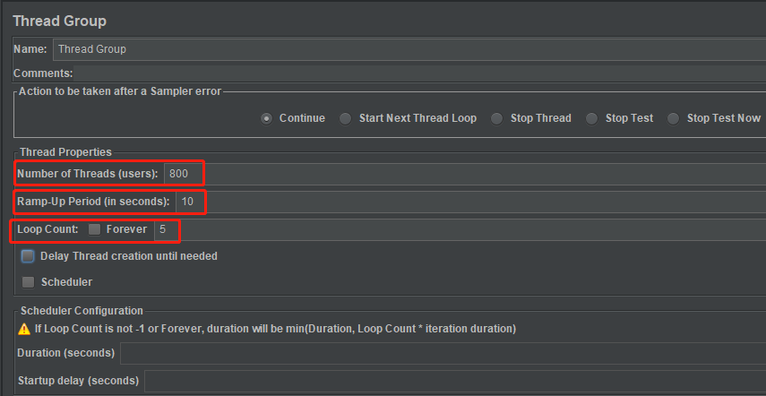
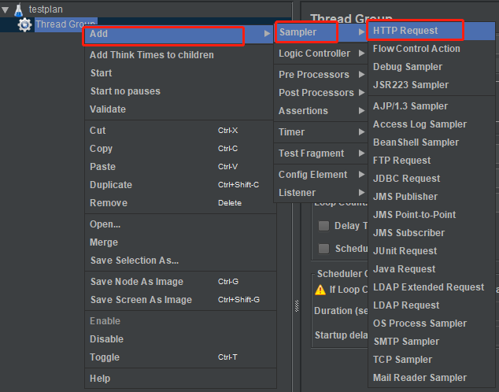
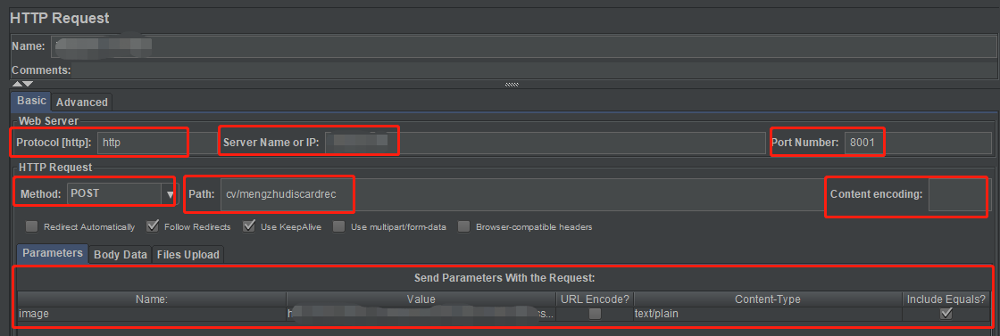
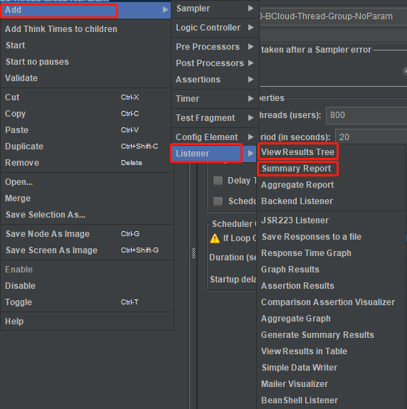
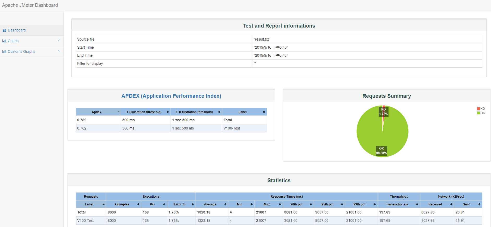

# API Stress-Testing with JMeter
## Introduction
This article describes several keypoint elements to test your RESTful APIs. To begin with, you should make sure you have installed the following softwares or SDK:
- [JDK>=8.0](https://www.oracle.com/technetwork/java/javase/downloads/index.html)
- [JMeter](https://jmeter.apache.org/download_jmeter.cgi)

Author: [@LucasX](https://github.com/lucasxlu)


## Basic Usage
1. Enter `bin` directory and run `jmeter.bat` (on Windows) or `jmeter.sh` (on Linux), you will see GUI of JMeter as follows:  



2. Right-click `testplan`, choose `Add-Threads(Users)-Thread Group`



3. Modify the default settings:  
There are mainly `3` key params:
* `Number of Threads (users)` means `how many QPS you will create to hit your API`, since JMeter utilize `Thread` to mock user visit
* `Ramp-Up Period (in seconds)` means how long your threads will be executed done. Take the following image setting as an example, it denotes that `800 threads` will be executed done within `10 seconds`. Namely, the average QPS is about `80/s`.
* `Loop Count` means the loop times will the thread group will be executed



3. Right-click `Thread Group`, choose `Add-Sampler-HTTP Request`



4. Modify the default settings, such as `protocol`, `server/IP`, `port number`, `send params`, and etc.



5. Click `Start` button, it will start sending HTTP requests to your API

6. Right-click `Add-Listener-Summary Report/View Results Tree` to view execution details



7. As mentioned by JMeter terminal--`Don't use GUI mode for load testing !, only for Test creation and Test debugging`. You should save your `TestPlan.jmx` file, and execute test plan with command line:  
```shell
./jmeter.sh -n -t ./testplan/YOUR_TEST_PLAN.jmx -l testplan/result/result.txt -e -o testplan/webreport
```  
It will generate `results file` and `web report`, just open the `index.html` with your browser, you will see:


