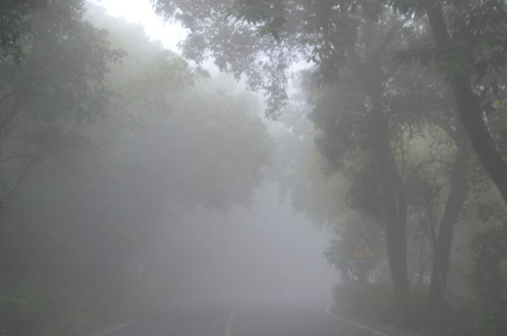
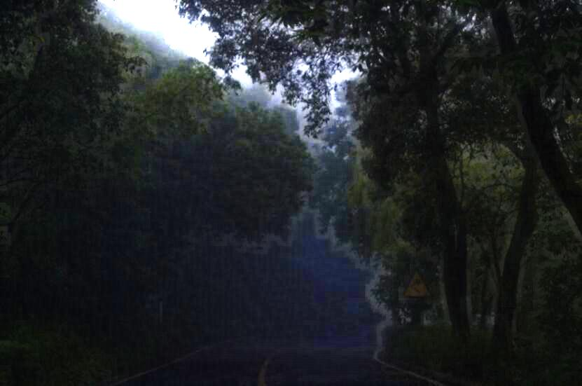

# Image Dehazing
## Introduction
This repository holds the **Python3** implementation of [Single Image Haze Removal Using Dark Channel Prior](http://projectsweb.cs.washington.edu/research/insects/CVPR2009/award/hazeremv_drkchnl.pdf).

If the scripts throw `AttributeError: __float__`, make sure your pillow has jpeg support e.g. try:

    $ sudo apt-get install libjpeg-dev
    $ sudo pip uninstall pillow
    $ sudo pip install pillow

## How to use

Enter `src` directory and run `python main.py`. It will use images under `img` 
directory as 
default
 to produce the results. The results will show up in `result` directory.

To test special configurations for a given image, for example, to test the image with index `0` (check `IMG_NAMES` in `util.py` for indexes) and `tmin = 0.2`, `Amax = 170`, `w = 15`, `r = 40`, run

    $ python3 main.py -i 0 -t 0.2 -A 170 -w 15 -r 40

## Examples
* Original image:

* After dehazing:

## Naming convetion of the results

For input image `name.jpg` using the default parameters, the naming convention is:

1. dark channel: `name-dark.jpg`
2. raw transmission map: `name-rawt.jpg`
3. refined tranmission map: `name-refinedt.jpg`
4. image dehazed with the raw transmission map: `name-radiance-rawt.jpg`
5. image dehazed with the refined transmission map: `name-radiance-refinedt.jpg`

If there are special configurations for the parameters, for example, , then the base name will be appended with `-20-170-50-40` e.g. the dark channel is `name-dark-20-170-50-40.jpg`

## Directory structure

    .
	├─ README.md
	├─ requirements.txt
	├─ img (source images)
	│   └── ... (input images)
	├─ result (the results)
    │   └── ...
	└─ src (the python source code)
        ├── dehaze.py (dehazing using the dark channel prior)
        ├── main.py (generate the results for the report)
        ├── guidedfilter.py (guided filter)
        └── util.py (utilities)
		
		
## References
1. He K, Sun J, Tang X. [Single image haze removal using dark channel prior](http://projectsweb.cs.washington.edu/research/insects/CVPR2009/award/hazeremv_drkchnl.pdf)[J]. IEEE transactions on pattern analysis and machine intelligence, 2010, 33(12): 2341-2353.
2. [dark-channel-prior-dehazing](https://github.com/joyeecheung/dark-channel-prior-dehazing.git)