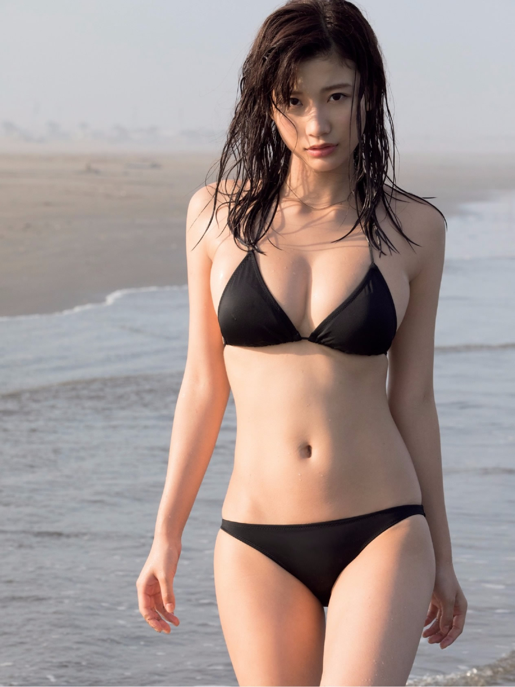

# Image Censorship
## Introduction
This module holds the source code for _image censorship_, namely, _pornography_ and _political figures_ recognition.

Note: The dataset for pornography recognition is downloaded from [nsfw_data_scrapper](https://github.com/alexkimxyz/nsfw_data_scrapper.git). 

## Data Statistics
| Type | Capacity |
| :---: |:---: |
| drawings | 22249 |
| hentai | 43412 |
| neutral | 9800 |
| porn | 110003 |
| sexy | 18299 |

## Performance
| Model | Accuracy | Precision | Recall |
| :---: |:---: |:---: |:---: |
| DenseNet121 | 93.31% | 90.68% | 89.72% |


## Usage
1. downloaded pretrained model from [Google Drive]()
2. run [inference](./inference.py) by passing your own image
3. model will return json results as:

* Example 1 


```json
{"message": "success",
 "results": [{"prob": 1.0, "type": "sexy"},
             {"prob": 0.0, "type": "neutral"},
             {"prob": 0.0, "type": "porn"},
             {"prob": 0.0, "type": "hentai"},
             {"prob": 0.0, "type": "drawings"}],
 "status": 0}
```

Note: the returned result indicates that ```sexy``` has the highest 
probability (prob=1.0)

* Example 2 

```json
{"message": "success",
 "results": [{"prob": 0.6981, "type": "neutral"},
             {"prob": 0.1811, "type": "porn"},
             {"prob": 0.1205, "type": "sexy"},
             {"prob": 0.0002, "type": "hentai"},
             {"prob": 0.0002, "type": "drawings"}],
 "status": 0}
```

Note: the returned result indicates that ```neutral``` has the highest 
probability (prob=0.6981)