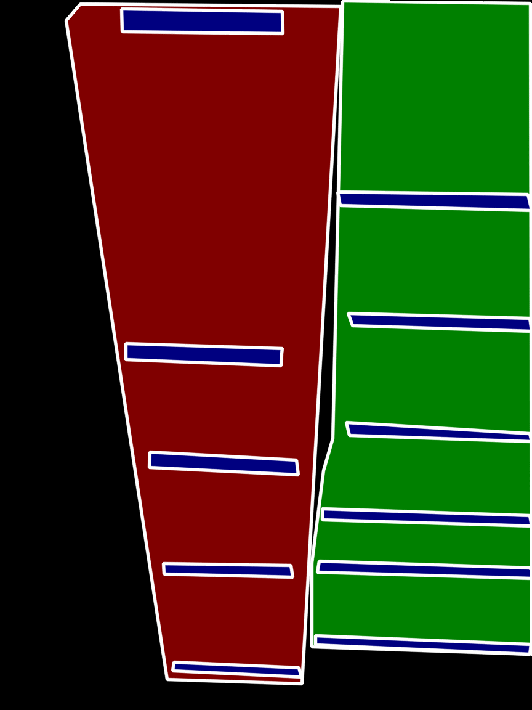

# Image Segmentation
## Introduction
This branch holds several state-of-the-art ``Semantic/Instance Segmentation``
 models such as [DeepLab v3+](http://openaccess.thecvf.com/content_ECCV_2018/papers/Liang-Chieh_Chen_Encoder-Decoder_with_Atrous_ECCV_2018_paper.pdf), [UNet](https://arxiv.org/pdf/1505.04597.pdf) and etc.
 
 
## Data Preparation
You can use [labelme](https://github.com/wkentaro/labelme.git) to draw ROI 
polygons, and then use [mask_generator.py]() to
 generate segmentation mask. You may also need [cvt_32bitpng_to_8bitpng.m](cvt_32bitpng_to_8bitpng.m) to convert 32bit PNG to 8bit PNG.
 
 After finishing previous steps, you will get the following generated mask in
  **8-bit** PNG like:
